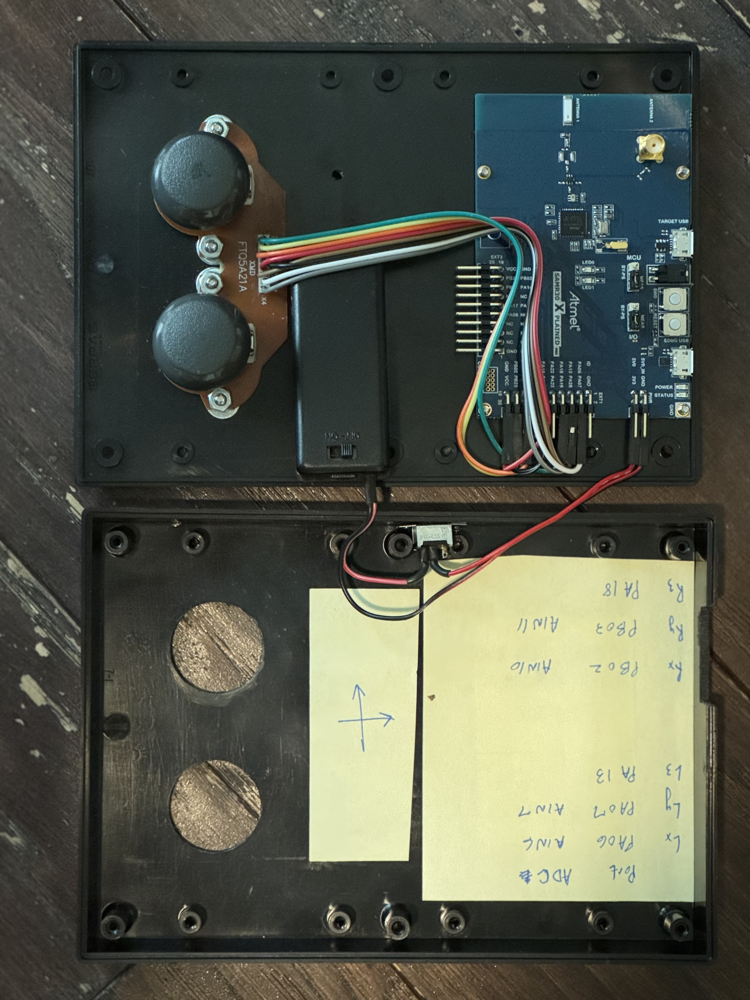

# R30_RC

This project is an 802.15.4 based remote control meant to pair with my [C21_ASF_RC_CAR](https://github.com/briantate/C21_ASF_RC_Car) project

It uses the Atmel [SAMR30 Xplained Pro](https://ww1.microchip.com/downloads/aemDocuments/documents/OTH/ProductDocuments/UserGuides/50002612A.pdf) board which features the SAMR30 wireless microcontroller. This is a Cortex M0+ with subGHz 802.15.4 radio. 

The battery powered SAMR30 samples two joysticks (via ADC), each of which controls the speed of one side of the differential steering system in the C21_ASF_RC_CAR. The sampled ADC data is filtered/limited and sent over the 802.15.4 radio using the Microchip MiWi protocol.

# To use the docker environment:
* Make sure the docker engine is running -- In windows, this means starting docker desktop and running the engine
    ## build the docker image using the dockerfile
    * make sure you are in the directory with the Dockerfile
    * >DOCKER_BUILDKIT=1 docker build -t cicd-dev .
        * enable the DOCKER_BUILDKIT to automatically build the image for the target architecture
    ## run the newly built docker image
    * >docker run --rm -it --privileged -v "$(PWD):/home/app" cicd-dev:latest bash

    ## use the docker image!
    * you should see a bash prompt looking something like this:
        * root@8f1800b29b3d:/home/app#
    * run the shell script to build/erase/program/etc...
        * root@8f1800b29b3d:/home/app# ./project.sh debug

# Flashing the project
* VSCode is used to program/debug
    * Install openocd on your machine and make sure it is in the "path"
    * tasks.json file is provided to "flash" the device with a new image
# Debugging the project
* Install the "Cortex Debug" extension
* launch.json file is provided for mapping a debug configuration to the extension
* Check that a debug image has been built
* In the "Run and Debug" tab in VSCode, click the "Play" button for the "Debug Launch (OpenOCD)" configuration
    * The project should start debugging and halt at main